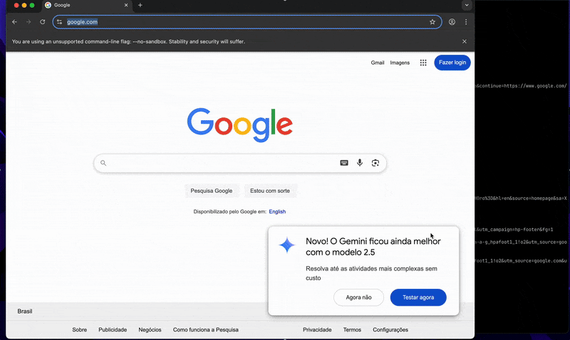

# MCP AGENT

MCP Agent implementation using only OpenAI client package. This project is to showcase of how easy is to build Agents and connect them to any MCP server. This is resource for the post [Building MCP Agent From Scratch](https://rodrigobaron.com/posts/building-mcp-agent)

## Install

Can install directly fom the repository:

```bash
uv pip install git+http://github.com/rodrigobaron/mcp-agent
```

or clone and install:

```bash
git clone http://github.com/rodrigobaron/mcp-agent
cd mcp-agent
uv pip install .
```

## How to use

The minimal usage is:

```python
fetch = MCPServerConfig(
    command="uvx",
    args=["mcp-server-fetch"],
)

agent = MCPAgent(model="<chose you model>", servers=[fetch])
async for step in agent.execute("what is this page about: https://rodrigobaron.com ?"):
    print(step.content)

```

A one step futher use case:

```python
uv run main.py
```

Should expect this behavior:



# License

This project is licensed under the Apache 2 License - see the LICENSE file for details.
